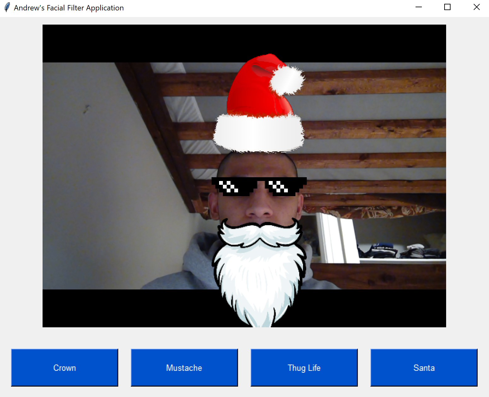

# Selfie Filter Application

## Description

A simple application that allows users to explore image overlay filters for a variety of items including hats, sunglasses, and facial hair. Inspired by [snapchat-filters-opencv](https://github.com/charlielito/snapchat-filters-opencv).

Three main tools were used:

1. OpenCV for video capture and image processing
2. Tkinter for the GUI application
3. Haar cascade pre-trained models for frontal face detection

Filters are constructed and applied to a live camera feed, which will be displayed within a simple Tkinter interface. There are a few notable avenues of improvement one can take. First, more work needs to be done to reduce the false positives in our facial detection; at times, the filters appear “glitchy” and unstable. It would be interesting to implement these image overlays using Dlib. Dlib is a newer computer vision library that is generally regarded as a faster, more stable and more accurate alternative to Haar cascade face detection. Dlib does a better job of detecting non-frontal faces and tilted faces.

## Helpful Sources

[Overlay transparent image in OpenCV](http://jepsonsblog.blogspot.com/2012/10/overlay-transparent-image-in-opencv.html)

[How to do Facial Recognition and Overlay](https://www.codementor.io/@powderblock/how-to-do-facial-recognition-and-overlay-superimpose-image-assets-python2-opencv-png-with-alpha-channel-transparency-zeqf7rjh0)

[Haar Cascade Classifiers Documentation](https://docs.opencv.org/3.4/d1/de5/classcv_1_1CascadeClassifier.html#aaf8181cb63968136476ec4204ffca498)

[How-To: OpenCV Load an Image](https://www.pyimagesearch.com/2014/06/02/opencv-load-image/)

[Face Instagram Filter Youtube Video](https://www.youtube.com/watch?v=IJpTe-1cimE)

[Stackoverflow Question on Threading](https://stackoverflow.com/questions/30197023/pass-arguments-from-a-class-to-another-class-that-inherits-from-threading-thread)

[Snapchat filters using OpenCV Youtube Video](https://www.youtube.com/watch?v=IVTFacCsHLo&t=6s)
"# Sticker-Filter-Instagram" 
